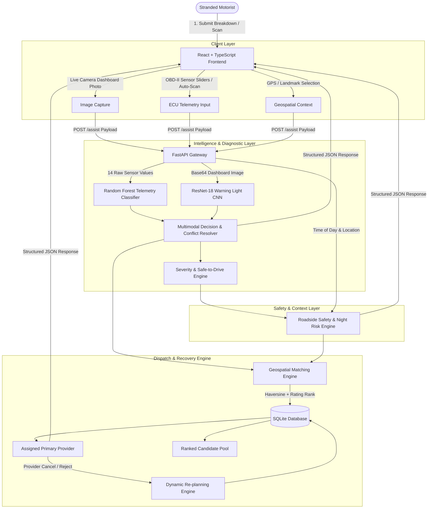

# 🚗 Intelligent Multimodal Vehicle Breakdown Assistance & Adaptive Recovery System

[](https://python.org)
[](https://fastapi.tiangolo.com)
[](https://react.dev)
[](https://www.typescriptlang.org/)
[](https://pytorch.org)
[](https://scikit-learn.org)

An intelligent, end-to-end distributed emergency roadside assistance and recovery platform. The system bridges vehicle telematics, computer vision, situational roadside safety awareness, and geospatial recovery provider dispatch.

---

## 👥 Team & Subsystem Ownership

| Team Member | Engineering Role | Core Subsystem Responsibilities |
|---|---|---|
| **Vishal** | **Machine Learning & Computer Vision** | • 14-parameter OBD-II telemetry Engine Fault Classifier (`RandomForestClassifier`, 74.76% Acc, 0.7556 F1)<br>• 18-class Dashboard Warning Light Recognition Model (`ResNet-18`, 89.05% Acc, 0.8893 F1)<br>• Multimodal fusion logic & capability resolution rules |
| **Ujwal** | **Backend & System Architecture** | • FastAPI REST API Gateway & modular routing architecture<br>• Geospatial dispatch engine (Haversine distance + Rating score weighting)<br>• Roadside safety & night-time contextual risk escalation engine<br>• SQLite database schema & dynamic adaptive replanning |
| **Waleed** | **Frontend UI/UX Engineering** | • React 18 + TypeScript + Vite responsive web application<br>• Interactive Leaflet dispatch & coverage map<br>• Live AI diagnostic visualization, confidence meters & safety advisory cards<br>• Multi-step breakdown intake portal with camera integration & preset scenarios |

---

## 🏛️ System Architecture



---

## ✨ Key System Features

### 1. 🔍 Multimodal AI Fault Diagnosis
- **Physical Telemetry Classifier**: Ingests 14 real-time automotive sensor readings (`MAP`, `TPS`, `Force`, `Power`, `RPM`, `Consumption L/H`, `Consumption L/100KM`, `Speed`, `CO`, `HC`, `CO2`, `O2`, `Lambda`, `AFR`) trained on the deduplicated **EngineFaultDB** benchmark dataset.
- **Computer Vision Warning Light Recognition**: Automatically classifies dashboard warning icons across 18 classes using a 2-stage transfer learning ResNet-18 model.
- **Multimodal Decision Matrix**: Intelligently reconciles visual evidence and sensor data with safety-critical hierarchy ($Towing > Engine\ Repair > Battery\ Jumpstart > Tire\ Change$).

### 2. 🛡️ Context-Aware Roadside Safety Guidance
- **Nighttime Risk Escalation**: Automatically detects nighttime breakdown conditions (21:00 to 06:00) and elevates response priority.
- **Dynamic Driveability Advisory**: Provides tailored instructions depending on whether the vehicle is `safe_to_drive` or must remain stationary.
- **Distance-Based Rough ETA Bands**: Translates provider distance into realistic arrival estimates and waiting recommendations.

### 3. 📍 Geospatial Provider Dispatch & Multi-Factor Scoring
- **Great-Circle Haversine Formula**: Calculates exact road distances between driver coordinates and service centers.
- **Weighted Quality Scoring**:
  $$\text{Score} = \text{Distance (km)} - 2.0 \times \text{Rating}$$
  Prioritizes top-rated technicians within close proximity.
- **Strict Vehicle & Capability Filtering**: Ensures matching providers possess both required equipment and vehicle taxonomy compatibility (Cars, Motorcycles, SUVs, Auto Rickshaws, Trucks, Vans).

### 4. 🔄 Adaptive Dynamic Replanning
- If an assigned recovery technician is unavailable or cancels, the driver can trigger a 1-click replan.
- The engine reallocates the breakdown to the next best candidate while strictly excluding previous failed providers.

### 5. 🗺️ Modern Interactive Web Portal
- High-performance React 18 interface with Leaflet interactive maps, glassmorphism design, brand quick-selectors, simulated OBD-II scans, and live dispatch tracking.

---

## 🧰 Technology Stack Matrix

| Layer | Technologies & Frameworks |
|---|---|
| **Machine Learning & CV** | Python 3.13, PyTorch 2.13, Torchvision, Scikit-Learn, NumPy, Pandas, Joblib, Pillow, Matplotlib, Seaborn |
| **Backend API Services** | FastAPI, Uvicorn, SQLAlchemy ORM, Pydantic v2, SQLite |
| **Frontend Application** | React 18, TypeScript, Vite 5, Leaflet, React-Leaflet, Lucide React, CSS3 Variables & Glassmorphism |
| **Testing & Quality** | Pytest, ESLint, TypeScript Strict Mode |

---

## 🚀 Quick Start & Installation

### Prerequisites
- Python 3.10+ (Recommended: Python 3.11 or 3.13)
- Node.js v18+ and npm
- Git

---

### Step 1: Clone Repository
```bash
git clone https://github.com/ujwalshetty625/vehicle-breakdown-assist.git
cd vehicle-breakdown-assist
```

---

### Step 2: Backend Setup & Execution
```bash
# 1. Install backend dependencies
pip install -r backend/requirements.txt

# 2. Seed SQLite database with initial providers & capabilities
python -c "import sys; sys.path.insert(0, 'backend'); from app.db.seed import seed; seed()"

# 3. Launch FastAPI backend server (from workspace root)
python -m uvicorn --app-dir backend app.main:app --reload --host 127.0.0.1 --port 8000
```
*Alternatively, you can navigate directly into the backend directory:*
```bash
cd backend
python -m app.db.seed
python -m uvicorn app.main:app --reload --host 127.0.0.1 --port 8000
```
Backend API will be live at: `http://127.0.0.1:8000` (API Docs: `http://127.0.0.1:8000/docs`).

---

### Step 3: Frontend Setup & Execution
Open a new terminal window:
```bash
cd frontend

# 1. Install node dependencies
npm install

# 2. Launch Vite development server
npm run dev
```
Frontend web portal will be live at: `http://localhost:5173`.

---

### Step 4: Machine Learning & CV Pipeline (Optional / Retraining)
```bash
# 1. Install ML dependencies
pip install -r ml/requirements.txt

# 2. Preprocess & run 5-fold CV for Engine Telemetry Model
python ml/src/preprocessing.py
python ml/src/train.py
python ml/src/evaluate.py

# 3. Train & Evaluate Warning Light CV Model
python ml/src/cv_train.py
```

---

## 📚 Complete Project Documentation

Detailed technical design documents are available in the repository:

- 📖 **[System Architecture Deep-Dive](docs/ARCHITECTURE.md)**: Full component diagrams, data flow, ML fusion logic, and database ERD.
- 📡 **[REST API Specification](docs/API_DOCUMENTATION.md)**: Complete request and response payloads for all backend endpoints.
- 📋 **[Project Tracking & Review Matrix](docs/PROJECT_TRACKING.md)**: Feature deliverables, status, milestone timelines, and review readiness.
- 🧠 **[ML Telemetry Model Card](ml/model_card.md)**: Model card for the 14-parameter Random Forest Engine Fault Classifier.
- 👁️ **[CV Warning Light Model Card](ml/cv_model_card.md)**: Model card for the ResNet-18 Dashboard Warning Light Classifier.
- 💻 **[Frontend Architecture Guide](frontend/README.md)**: Component breakdown, state management, and styling guides.

---

## 🧪 Testing & Verification

```bash
# Run backend test suite
pytest backend/tests

# Run frontend production build validation
cd frontend && npm run build
```

---

## 📜 Academic Integrity & License
Developed as a Final Year Capstone Project. Benchmark telemetry dataset sourced from **EngineFaultDB** (Vergara et al., 2023, IEEE Access).