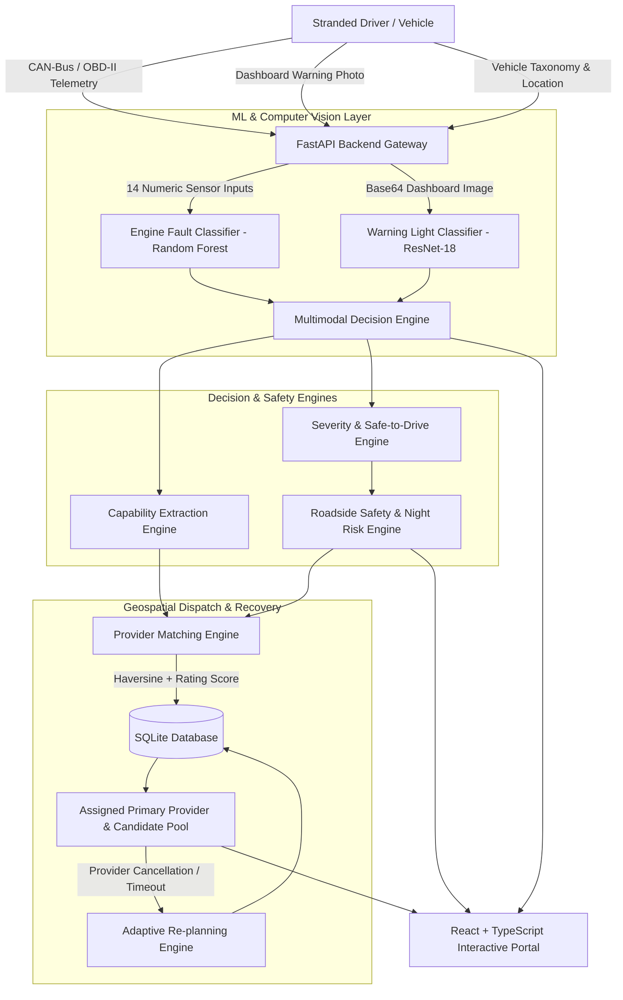
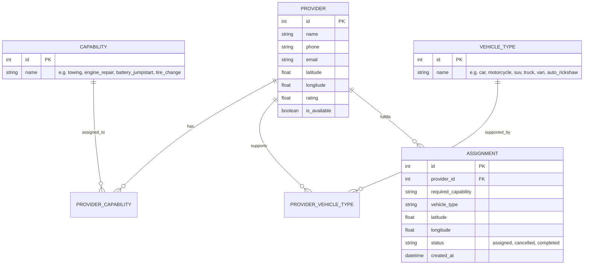

# System Architecture: Intelligent Multimodal Vehicle Breakdown Assistance & Adaptive Recovery System

## 1. Executive Summary & System Vision

The **Intelligent Multimodal Vehicle Breakdown Assistance & Adaptive Recovery System** is an end-to-end, distributed automotive emergency response platform. It bridges the gap between vehicle onboard diagnostics, driver situational awareness, and roadside service dispatch.

When a vehicle breaks down, standard roadside assistance platforms rely on subjective, verbal descriptions from stranded motorists who often lack technical knowledge. This leads to misdiagnosis, incorrect equipment dispatch (e.g., sending a jumpstart technician for a catastrophic fuel mixture or transmission failure), extended roadside wait times, and heightened personal safety risks—especially during nighttime or isolated highway conditions.

This platform solves these challenges through a **three-tier intelligent pipeline**:
1. **Multimodal Diagnostic Intelligence**: Combines real-time 14-parameter OBD-II engine telemetry with deep learning Computer Vision dashboard warning light image classification.
2. **Context-Aware Safety & Risk Assessment**: Dynamically assesses roadside risk factoring in fault severity, driveability (`safe_to_drive`), time of day (`is_night`), and estimated provider arrival times.
3. **Adaptive Geospatial Dispatch & Replanning Engine**: Matches the closest, highest-rated service provider possessing exact vehicle compatibility and technical capabilities, with automated one-click adaptive replanning upon refusal or delay.



---

## 2. Multimodal Diagnostic Subsystem (ML / CV Layer)

The diagnostic subsystem ingests two complementary data modalities to ensure robust fault identification:

### 2.1 Modality A: Physical Engine Telemetry Classifier (`RandomForestClassifier`)
- **Training Source**: Deduplicated **EngineFaultDB** benchmark (55,998 samples across 14 numeric sensors).
- **Architecture**: 200-tree ensemble with balanced class weights and maximum depth of 25.
- **Features (14 Frozen Inputs)**:
  1. `MAP` (Manifold Absolute Pressure, kPa)
  2. `TPS` (Throttle Position Sensor, %)
  3. `Force` (Engine Output Tractive Force, N)
  4. `Power` (Engine Power, kW)
  5. `RPM` (Crankshaft Speed, RPM)
  6. `Consumption L/H` (Fuel Flow Rate, L/h)
  7. `Consumption L/100KM` (Normalized Fuel Consumption, L/100km)
  8. `Speed` (Vehicle Ground Speed, km/h)
  9. `CO` (Carbon Monoxide Exhaust Concentration, %)
  10. `HC` (Hydrocarbon Emissions, ppm)
  11. `CO2` (Carbon Dioxide Exhaust Concentration, %)
  12. `O2` (Oxygen Exhaust Concentration, %)
  13. `Lambda` (Air-Fuel Equivalence Ratio $\lambda$)
  14. `AFR` (Air-to-Fuel Ratio)
- **Target Classes**:
  - `0`: No Fault (Normal Vehicle Operation)
  - `1`: Rich Mixture (Combustion anomaly / excessive fuel delivery)
  - `2`: Lean Mixture (Air leak / fuel starvation)
  3. `3`: Low Voltage (Alternator / Battery degradation)
- **Performance**: **74.76% Test Accuracy**, **0.7556 Macro F1-Score** (5-Fold Cross-Validation).

### 2.2 Modality B: Dashboard Warning Light Classifier (`ResNet-18 Transfer Learning`)
- **Training Source**: Curated dataset of dashboard warning icons across diverse lighting conditions, angles, and camera resolutions.
- **Architecture**: Deep Residual Network (ResNet-18) with a 2-stage transfer learning regime (Frozen Backbone feature extraction followed by whole-network fine-tuning with Cosine Annealing Learning Rate scheduling).
- **Target Classes (18 Categories)**:
  - Battery / Alternator Alert
  - Brake System Warning
  - Check Engine / Malfunction Indicator (MIL)
  - Coolant Temperature High
  - Oil Pressure Low
  - Tire Pressure Monitoring System (TPMS)
  - ABS Alert, Airbag Warning, Transmission Warning, Electronic Stability (ESP), etc.
- **Performance**: **89.05% Test Accuracy**, **0.8893 Macro F1-Score**.

### 2.3 Multimodal Fusion & Capability Resolution Logic
The backend integrates telemetry ML and visual CV outputs using an evidence-priority matrix:

$$\text{Capability} = f(\text{Telemetry\_Capability}, \text{CV\_Capability}, \text{Confidence}_{\text{cv}}, \text{Symptoms})$$

1. **CV Low Confidence Threshold ($< 0.65$)**: If visual confidence is below 65%, the system falls back exclusively to telemetry-derived diagnosis.
2. **Conflict Resolution Hierarchy**:
   $$\text{Towing (Priority 4)} > \text{Engine Repair (Priority 3)} > \text{Battery Jumpstart (Priority 2)} > \text{Tire Change (Priority 1)}$$
   When telemetry and high-confidence CV disagree, the higher safety-critical capability is selected to guarantee user protection.

---

## 3. Backend Architecture & Service Layer

The backend is built with **FastAPI** (Python 3.11+ / 3.13) following clean modular architecture:

```
backend/app/
├── api/                    # REST API Endpoints & Routers
│   ├── assist.py           # Unified multimodal assistance endpoint (/assist)
│   ├── match_provider.py   # Direct provider matching (/match-provider)
│   ├── replan.py           # Adaptive recovery reallocation (/replan)
│   ├── diagnose.py         # Standalone telemetry diagnostic endpoint (/diagnose)
│   ├── diagnostics.py      # OBD-II presets & ECU auto-scan simulation (/diagnostics/*)
│   ├── vehicle_types.py    # Supported vehicle categories & taxonomy (/vehicle-types)
│   └── providers.py        # Provider management & directory (/providers)
├── db/                     # Data Persistence Layer
│   ├── models.py           # SQLAlchemy ORM Models (Provider, Capability, Assignment)
│   ├── session.py          # SQLite engine & session factory
│   └── seed.py             # Database seeder with realistic regional providers
├── ml_integration/         # AI Model Inference Connectors
│   ├── inference.py        # Engine Fault Random Forest inference wrapper
│   ├── cv_inference.py     # Computer Vision ResNet-18 base64 inference wrapper
│   └── model_loader.py     # Lazy model artifact deserializer
├── schemas/                # Pydantic Schemas & Data Contracts
│   ├── assist.py           # AssistRequest & Multimodal Assist Response Schemas
│   ├── match.py            # MatchRequest, MatchedProviderOut, ReplanRequest
│   └── provider.py         # ProviderOut, ProviderCreate Schemas
├── services/               # Core Domain Business Logic
│   ├── diagnosis.py        # Fault-to-Capability mapping rules
│   ├── severity.py         # Severity rating & safe_to_drive determination
│   ├── matching.py         # Haversine calculation & provider scoring algorithm
│   └── roadside_safety.py  # Time context classification & night risk assessment
└── main.py                 # Application bootstrap & CORS middleware configuration
```

---

## 4. Geospatial Dispatch & Adaptive Replanning Engine

### 4.1 Great-Circle Distance Calculation (Haversine Formula)
Given the driver coordinates $(\phi_1, \lambda_1)$ and provider coordinates $(\phi_2, \lambda_2)$:

$$a = \sin^2\left(\frac{\Delta \phi}{2}\right) + \cos(\phi_1)\cos(\phi_2)\sin^2\left(\frac{\Delta \lambda}{2}\right)$$

$$c = 2 \cdot \text{atan2}\left(\sqrt{a}, \sqrt{1-a}\right)$$

$$d = R \cdot c \quad (\text{where } R = 6371.0 \text{ km})$$

### 4.2 Multi-Factor Provider Scoring Function
Providers are filtered by **active availability**, **exact capability match**, and **vehicle taxonomy compatibility** (Car, Motorcycle, SUV, Auto Rickshaw, Truck, Van), then ranked using:

$$\text{Score} = d - (R_{\text{rating}} \times 2.0)$$

*Lower score is superior.* A 5-star provider 10 km away achieves a score of $10 - 10 = 0$, outranking a 3-star provider 7 km away ($7 - 6 = 1.0$), rewarding service quality while penalizing distance.

### 4.3 Adaptive Re-planning Flow
If an assigned provider declines the dispatch, fails to respond, or traffic conditions cause excessive delay:
1. Client sends `POST /replan` with `assignment_id` and `exclude_provider_id`.
2. The engine re-queries available providers, strictly excluding the failed provider.
3. The next best candidate is immediately assigned and the database assignment record is updated in place.

---

## 5. Roadside Safety & Time-Contextual Risk Engine

Breakdown risk is not static; it is heavily amplified by ambient conditions and response delays:

| Time Band | Classification | Night Priority | Base Risk Modifier |
|---|---|---|---|
| **06:00 – 18:00** | `day` | `normal` | Low / Standard Waiting |
| **18:00 – 21:00** | `evening` | `normal` | Moderate Visibility |
| **21:00 – 06:00** | `night` | `elevated` | **High Priority Escalation** |

### Dynamic Safety Advisory Matrix
- **`safe_to_drive: False` + Night + Long Wait ($>8\text{ km}$)** $\rightarrow$ **High Risk**: Directs user to remain visible, activate hazard flashers, and consider moving to a safe, well-lit public area.
- **No Provider Matched** $\rightarrow$ **Elevated Risk**: Displays emergency contact recommendations and automatic retry guidance.
- **`safe_to_drive: True`** $\rightarrow$ Informs driver they may carefully proceed to the assigned provider facility if safe to do so.

---

## 6. Frontend Architecture (React + TypeScript + Vite)

The frontend provides an intuitive, high-performance portal designed for distressed drivers in emergency situations:

- **State Management**: Reactive state tracking breakdown parameters, simulated OBD-II scan streams, camera capture base64 encodings, and live dispatch updates.
- **Component Breakdown**:
  - `Breakdown.tsx`: Multi-step diagnostic input portal with 1-click popular brand selectors, preset symptom cards, interactive OBD-II parameter sliders, voice-to-text input, and live camera dashboard photo upload.
  - `Results.tsx`: Emergency command center rendering the AI diagnosis card, confidence meter, class probability distributions, roadside safety alerts, and provider cards.
  - `InteractiveMap.tsx`: Interactive Leaflet map displaying driver geolocation marker, primary provider route, and alternative provider pins.
  - `SafetyCard.tsx`: Contextual risk level badge (Low / Moderate / Elevated / High) with actionable roadside safety instructions.
  - `ProviderCard.tsx`: Verified technician profile with phone dialer, WhatsApp/SMS direct link, ETA countdown, and 1-click Re-plan button.

---

## 7. Database Entity Relationship Model


