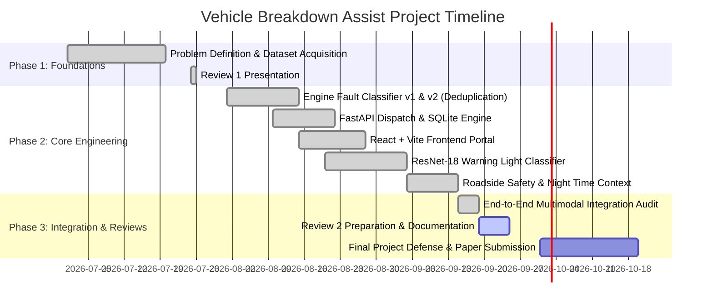

# Project Tracking & Process Documentation

**Project**: Intelligent Multimodal Vehicle Breakdown Assistance and Adaptive Recovery System  
**Academic Year**: Final Year Capstone Project  
**Repository**: `ujwalshetty625/vehicle-breakdown-assist`  
**Team**:
- **Vishal** (Machine Learning & Computer Vision Subsystems)
- **Ujwal** (Backend Architecture, Geospatial Dispatch & Safety Services)
- **Waleed** (Frontend UI/UX, Dynamic Maps & Diagnostic Portal)

---

## 1. Feature & Subsystem Responsibility Matrix

| Subsystem / Feature | Owner | Core Files | Status | Test / Verification |
|---|---|---|:---:|:---:|
| **OBD-II Engine Fault Classifier** | Vishal | `ml/src/train.py`, `ml/src/preprocessing.py`, `ml/models/model.pkl`, `ml/model_card.md` | **Completed** | 5-Fold Stratified CV (74.76% Acc, 0.7556 F1) |
| **Warning Light Computer Vision Model** | Vishal | `ml/src/cv_train.py`, `ml/src/cv_inference.py`, `ml/models/cv_model.pt`, `ml/cv_model_card.md` | **Completed** | 2-Stage Transfer Learning (89.05% Acc, 0.8893 F1) |
| **Multimodal Decision Matrix** | Vishal | `ml/src/cv_inference.py`, `backend/app/api/assist.py` (`_select_multimodal_capability`) | **Completed** | Priority hierarchy verification ($Towing > Engine > Battery > Tire$) |
| **FastAPI Backend Gateway** | Ujwal | `backend/app/main.py`, `backend/app/api/*.py`, `backend/requirements.txt` | **Completed** | Full endpoint routing & CORS validation |
| **Geospatial Dispatch Engine** | Ujwal | `backend/app/services/matching.py`, `backend/app/api/match_provider.py` | **Completed** | Haversine distance + Rating score ($d - 2r$) verification |
| **Roadside Safety & Night Risk Engine** | Ujwal | `backend/app/services/roadside_safety.py`, `backend/app/services/severity.py` | **Completed** | Unit tests in `backend/tests/test_roadside_safety.py` |
| **Dynamic Adaptive Re-planning** | Ujwal | `backend/app/api/replan.py`, `backend/app/db/models.py` | **Completed** | Exclusion logic and automatic fallback assignment |
| **React + Vite Frontend Interface** | Waleed | `frontend/src/App.tsx`, `frontend/src/pages/Breakdown.tsx`, `frontend/src/pages/Results.tsx` | **Completed** | End-to-end breakdown reporting & diagnostic review |
| **Interactive Leaflet Map** | Waleed | `frontend/src/components/InteractiveMap.tsx` | **Completed** | Driver pin, primary provider route & alternative pins |
| **Visual Roadside Safety Card** | Waleed | `frontend/src/components/SafetyCard.tsx` | **Completed** | Dynamic color coding (Low, Mod, Elev, High) & instructions |
| **ECU Auto-Scan & Presets** | Waleed / Ujwal | `frontend/src/pages/Breakdown.tsx`, `backend/app/api/diagnostics.py` | **Completed** | 1-click test simulation for 5 distinct breakdown scenarios |

---

## 2. Review Milestones & Deliverables

### Review 1 (Completed)
- Problem statement formulation: Eliminating breakdown misdiagnosis and reducing emergency wait times.
- Literature review: Benchmark study of OBD-II diagnostics and telematics.
- Architectural design and database schema.

### Review 2 (Current Milestone - Ready)
- Complete, trained dual AI pipeline:
  - 14-parameter OBD-II Random Forest classifier with rigorous deduplication and 5-fold cross-validation.
  - 18-class Computer Vision warning light classifier with ResNet-18 transfer learning.
- Full-stack integration:
  - Functional FastAPI backend with multimodal `/assist`, `/replan`, `/diagnostics/scan`.
  - Responsive React 18 frontend with Leaflet interactive map, photo upload, and live advisory cards.
  - Time-of-day contextual safety engine prioritizing nighttime stranded drivers.

### Final Capstone & Viva
- Real-time hardware integration prototype (OBD-II Bluetooth adapter demo).
- Deployment on cloud infrastructure (Containerized with Docker & Docker-Compose).
- Complete research paper publication submission.

---

## 3. Detailed Feature Breakdown & Artifacts

### Feature 1: Physical Engine Telemetry Diagnostics (ML)
- **Problem Solved**: Internal combustion anomalies (rich/lean mixtures) and electrical power delivery dropouts are undetectable by casual drivers, causing roadside stalls and engine damage.
- **Input**: 14 OBD-II sensor values (`MAP`, `TPS`, `Force`, `Power`, `RPM`, `Consumption L/H`, `Consumption L/100KM`, `Speed`, `CO`, `HC`, `CO2`, `O2`, `Lambda`, `AFR`).
- **Output**: Diagnostic class (`No Fault`, `Rich Mixture`, `Lean Mixture`, `Low Voltage`), class probability array, confidence percentage.
- **Model Card**: [`ml/model_card.md`](file:///c:/project/FINAL%20YEAR%20PROJECT/PROJECT/vehicle-breakdown-assist/ml/model_card.md)

### Feature 2: Dashboard Warning Light Visual Recognition (CV)
- **Problem Solved**: Drivers frequently ignore or misinterpret dashboard instrument cluster warning lights (e.g., confusing low oil pressure with general service lights).
- **Input**: Camera snapshot or uploaded photo of vehicle dashboard cluster (Base64 JPEG/PNG).
- **Output**: Warning light icon class (18 categories), confidence score, recommended capability, safety action.
- **Model Card**: [`ml/cv_model_card.md`](file:///c:/project/FINAL%20YEAR%20PROJECT/PROJECT/vehicle-breakdown-assist/ml/cv_model_card.md)

### Feature 3: Contextual Roadside Safety Guidance
- **Problem Solved**: Waiting on a dark highway or unlit street during nighttime has significantly higher personal safety hazards than daytime urban breakdowns.
- **Input**: Vehicle fault severity, `safe_to_drive` boolean, timestamp / hour of day, matched provider distance.
- **Output**: `risk_level` (`none`, `low`, `moderate`, `elevated`, `high`), step-by-step actionable waiting guidelines, rough ETA band (`5-15 min`, `15-25 min`, `20-35 min`, `30-50 min`, `50+ min`).

### Feature 4: Geospatial Provider Dispatch & Scoring
- **Problem Solved**: Dispatching the nearest provider without checking capability (e.g., sending a flatbed tow truck for a dead battery) causes wasted trips.
- **Input**: Driver coordinates $(lat, lng)$, vehicle taxonomy, required capability.
- **Output**: Ranked candidate pool sorted by $\text{Score} = \text{Distance (km)} - 2.0 \times \text{Rating}$.

### Feature 5: Dynamic Adaptive Replanning
- **Problem Solved**: If an assigned provider cancels, the driver is left stranded with no fallback.
- **Input**: `assignment_id`, `exclude_provider_id`.
- **Output**: Immediate assignment of next qualified provider from the candidate pool without re-entering breakdown data.

---

## 4. Known Boundaries & Engineering Decisions

1. **Synthetic Telemetry Simulation**: To enable realistic demonstrations without requiring a live OBD-II dongle connected to a moving vehicle during academic reviews, the system provides `/diagnostics/scan` and preset profiles based on actual benchmark data from EngineFaultDB.
2. **Deterministic Time Classification**: Night is classified as 21:00 (9 PM) to 06:00 (6 AM) based on server local time. In production, this can be synchronized with local sunrise/sunset APIs based on GPS coordinates.
3. **No Demographics Inference**: The safety engine deliberately avoids inferring user gender, age, or demographics to maintain algorithmic fairness and privacy; risk is strictly derived from objective factors (fault severity, illumination/time, distance, and safe-to-drive status).
