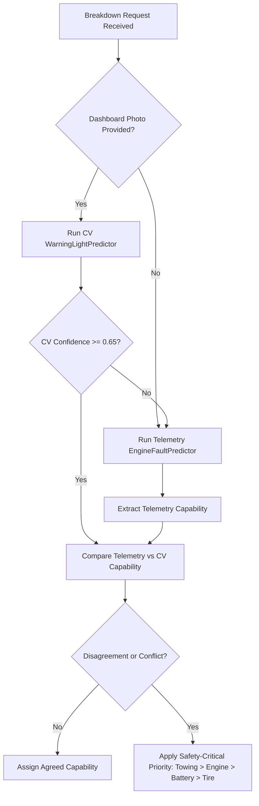

# Machine Learning & Computer Vision Subsystems

**Intelligent Multimodal Vehicle Breakdown Assistance and Adaptive Recovery System**

This directory contains the machine learning pipelines powering the intelligent diagnostic layer of the vehicle breakdown assistance platform. It comprises **two specialized AI systems**:
1. **Automotive Engine Telemetry Fault Classifier** (14-parameter OBD-II tabular data).
2. **Dashboard Warning Light Computer Vision Classifier** (Deep CNN image recognition).

---

## 📁 ML Directory Structure

```
ml/
├── data/                             # Raw and processed datasets (gitignored)
│   ├── EngineFaultDB_Final.csv       # Engine telemetry benchmark dataset
│   └── cv_dataset/                   # Dashboard warning icon image dataset
├── models/                           # Serialized model artifacts & evaluation metrics
│   ├── model.pkl                     # Champion RandomForestClassifier (Engine Telemetry)
│   ├── scaler.pkl                    # Fitted StandardScaler
│   ├── feature_order.json            # Frozen 14-feature order contract
│   ├── labels.json                   # Class ID to name mapping for telemetry
│   ├── metrics.json                  # Test evaluation metrics for telemetry model
│   ├── confusion_matrix.png          # High-resolution confusion matrix for telemetry
│   ├── feature_importance.png        # Gini importance plot of 14 OBD-II sensors
│   ├── cv_model.pt                   # Trained PyTorch ResNet-18 model weights (Warning Lights)
│   ├── cv_labels.json                # 18-class mapping for dashboard warning lights
│   ├── cv_preprocessing_config.json  # Image normalization constants & resolution config
│   ├── cv_metrics.json               # Test evaluation metrics for CV model
│   └── cv_confusion_matrix.png       # Confusion matrix for 18 warning light classes
├── notebooks/
│   ├── eda.ipynb                     # Exploratory Data Analysis notebook
│   └── generate_eda_notebook.py
├── src/
│   ├── __init__.py
│   ├── features.py                   # Feature schema, ordering constants & metadata
│   ├── preprocessing.py              # Telemetry deduplication, stratified 80/20 split & scaling
│   ├── train.py                      # 5-fold CV hyperparameter tuning & Random Forest training
│   ├── evaluate.py                   # Evaluation, test metrics export & plot generation
│   ├── cv_train.py                   # 2-stage transfer learning training script for ResNet-18
│   └── cv_inference.py               # WarningLightPredictor class & base64 inference wrapper
├── model_card.md                     # Integration contract for Telemetry Engine Model
├── cv_model_card.md                  # Integration contract for Dashboard CV Model
├── requirements.txt                  # Pinned dependencies for ML/CV environment
└── README.md                         # This documentation
```

---

## 🧠 System 1: Automotive Engine Telemetry Classifier

### Overview
- **Dataset**: **EngineFaultDB** (Vergara et al., 2023, IEEE Access, DOI: `10.1109/ACCESS.2023.3331316`).
- **Data Hygiene**: Deduplicated down to 55,998 unique physical sensor recordings across 14 numeric features.
- **Algorithm**: `RandomForestClassifier(n_estimators=200, max_depth=25, class_weight='balanced', random_state=42)`
- **Validation**: 5-Fold Stratified Cross-Validation on 44,798 training samples; evaluated on 11,200 held-out test samples.

### 14 Frozen Input Features
1. `MAP` (Manifold Absolute Pressure, kPa)
2. `TPS` (Throttle Position Sensor, %)
3. `Force` (Engine Output Tractive Force, N)
4. `Power` (Engine Power, kW)
5. `RPM` (Crankshaft Speed, RPM)
6. `Consumption L/H` (Fuel Flow Rate, L/h)
7. `Consumption L/100KM` (Normalized Fuel Consumption, L/100km)
8. `Speed` (Vehicle Ground Speed, km/h)
9. `CO` (Carbon Monoxide Exhaust Concentration, %)
10. `HC` (Hydrocarbon Emissions, ppm)
11. `CO2` (Carbon Dioxide Exhaust Concentration, %)
12. `O2` (Oxygen Exhaust Concentration, %)
13. `Lambda` (Air-Fuel Equivalence Ratio $\lambda$)
14. `AFR` (Air-to-Fuel Ratio)

### Performance Benchmarks
- **Overall Accuracy**: **74.76%**
- **Macro F1-Score**: **0.7556**
- **Weighted F1-Score**: **0.7464**

| Fault Class | Class ID | Precision | Recall | F1-Score | Test Support | Required Capability |
|---|:---:|:---:|:---:|:---:|:---:|---|
| **No Fault** | `0` | 1.0000 | 1.0000 | **1.0000** | 3,200 | *None* |
| **Rich Mixture** | `1` | 1.0000 | 1.0000 | **1.0000** | 2,200 | `engine_repair` |
| **Lean Mixture** | `2` | 0.5347 | 0.4447 | **0.4855** | 3,000 | `engine_repair` |
| **Low Voltage** | `3` | 0.4959 | 0.5854 | **0.5369** | 2,800 | `battery_jumpstart` |

👉 **For complete details, see [`ml/model_card.md`](model_card.md)**.

---

## 👁️ System 2: Dashboard Warning Light Computer Vision Classifier

### Overview
- **Architecture**: **ResNet-18** (Residual Neural Network) initialized with ImageNet pre-trained weights.
- **Training Strategy**: 2-Stage Transfer Learning
  1. *Stage 1 (Feature Extraction)*: Frozen convolutional backbone, training custom classification head with Adam optimizer ($lr = 10^{-3}$).
  2. *Stage 2 (Fine-Tuning)*: Unfrozen layers with Cosine Annealing learning rate schedule ($lr = 10^{-4}$ down to $10^{-6}$).
- **Target Classes (18 Categories)**:
  `abs_alert`, `airbag_warning`, `battery_alert`, `brake_system_warning`, `check_engine`, `coolant_temperature_high`, `electronic_stability_control`, `fog_light`, `glow_plug_diesel`, `high_beam`, `low_fuel_warning`, `oil_pressure_low`, `power_steering_alert`, `seatbelt_reminder`, `tire_pressure_warning`, `traction_control`, `transmission_warning`, `washer_fluid_low`.

### Performance Benchmarks
- **Overall Accuracy**: **89.05%**
- **Macro F1-Score**: **0.8893**
- **Macro Precision**: **0.8941**
- **Macro Recall**: **0.8872**

👉 **For complete details, see [`ml/cv_model_card.md`](cv_model_card.md)**.

---

## 🔀 Multimodal Fusion & Capability Resolution

When both telemetry sensor readings and a dashboard photo are provided, the backend applies the following decision rules:



---

## 🚀 Setup, Training & Evaluation Guide

### 1. Install Dependencies
```bash
pip install -r ml/requirements.txt
```

### 2. Telemetry Pipeline Execution
```bash
# Step 1: Preprocess dataset & fit scaler
python ml/src/preprocessing.py

# Step 2: Run 5-fold CV & train champion Random Forest model
python ml/src/train.py

# Step 3: Evaluate test set & generate confusion matrix plots
python ml/src/evaluate.py
```

### 3. Computer Vision Pipeline Execution
```bash
# Train ResNet-18 Warning Light Classifier
python ml/src/cv_train.py

# Test single image inference
python -c "from ml.src.cv_inference import WarningLightPredictor; predictor = WarningLightPredictor(); print(predictor.predict_from_path('test_image.jpg'))"
```

---

## 📦 Model Artifact Storage & Git LFS
- `ml/models/model.pkl` (17.87 MB)
- `ml/models/cv_model.pt` (43.24 MB)
- All artifacts are kept under GitHub's 100 MB hard limit and tracked directly in the repository for immediate out-of-the-box evaluation.
